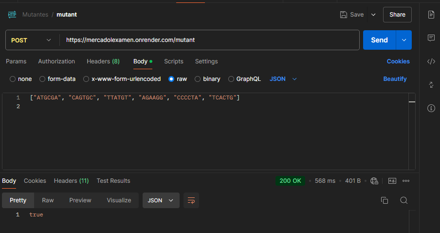

__FUNCIONAMIENTO__

https://mercadolexamen.onrender.com/

Uso de la API en postman con el deploy en render 

Para la misma request vamos a hacer un GET 

__Cadenas para probar el funcionamieanto__ 

    CASOS MUTANTES
        String[] dnaMutant1 = {"ATGCGA", "CAGTGC", "TTATGT", "AGAAGG", "CCCCTA", "TCACTG"}; 
            String[] dnaMutant2 = {"ATGCGA", "CAGTGC", "TTAAGT", "AGATGG", "CTCCTA", "TCACTG"};
                String[] dnaMutant3 = {"AAAAAA", "CTGAGA", "TTATGT", "AGACGG", "GCGTCA", "TCACTG"};
                    String[] dnaMutant4 = {"ATGCGA", "CAGTGC", "TTAAGT", "AGATGG", "CTGCTA", "TCACTG"};
                        String[] dnaMutant5 = {"ATGCGA", "CTGTGC", "TTGTGT", "AGTGGG", "CTCTTA", "TCACTG"};

    CASOS NO MUTANTES
        String[] dnaHuman1 = {"ATGCGA", "CAGTGC", "TTATGT", "AGACGG", "GCGTCA", "TCACTG"};
            String[] dnaHuman2 = {"ATGCGA", "CAGTGC", "TTATTT", "AGACGG", "GCGTCA", "TCACTG"};
                String[] dnaHuman3 = {"ATGCTA", "CAGTGC", "TTATTT", "AGACGG", "GCGTCA", "TCACTG"};
                     String[] dnaHuman4 = {"ATGCGA", "CATGGC", "TTATTT", "AGACGG", "CCGTCA", "TCACTG"};
                        String[] dnaHuman5 = {"ATGCGA", "CAGTAC", "TTATTT", "AGTCGG", "GCGTCA", "TCACTG"};